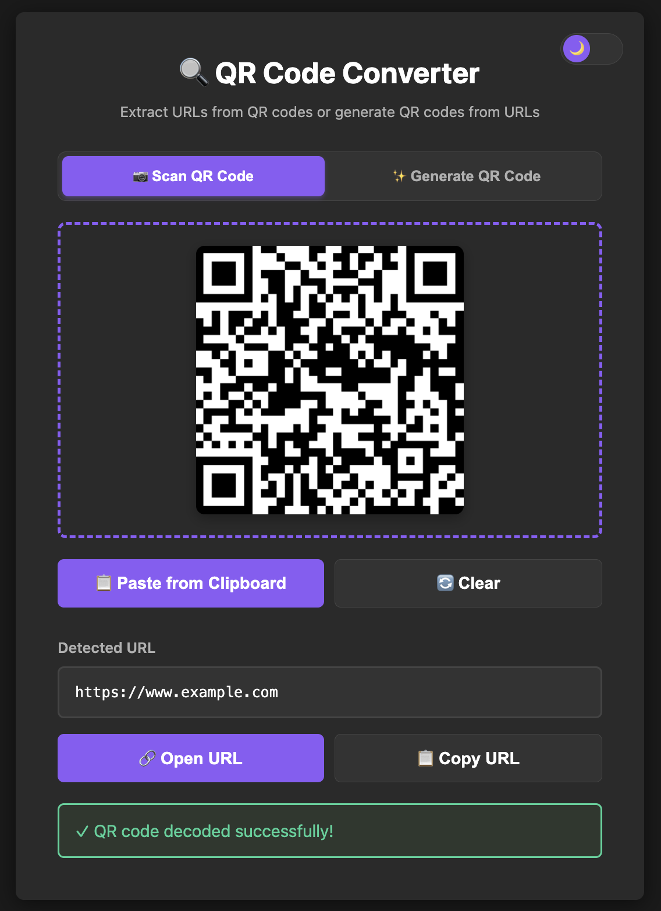

# QR Code Converter

A modern, browser-based QR code converter that can both scan QR codes to extract URLs and generate QR codes from URLs. Built with vanilla JavaScript and featuring a sleek dark/light theme interface.

**Live Demo**: [Try it on Claude Artifact](https://claude.ai/public/artifacts/b1361792-96be-4597-b97c-5e09de3c3db4)

## Features

- **Dual Functionality**: Scan QR codes OR generate them
- **Multiple Input Methods**:
  - Drag & drop QR code images
  - Click to select files
  - Paste from clipboard (Ctrl+V)
  - Paste button for quick access
- **QR Code Generation**: Create QR codes from any URL
- **Export Options**: Download QR codes or copy them to clipboard
- **Theme Support**: Toggle between dark and light modes
- **Modern UI**: Clean, responsive interface with smooth animations
- **No Backend Required**: Runs entirely in the browser
- **Privacy-Focused**: All processing happens locally

## Screenshots

### Scanning QR Codes


Upload or paste a QR code image to instantly extract the URL. The app will detect and decode the QR code, then display the URL with options to open or copy it.

### Generating QR Codes


Enter any URL to generate a QR code. Download it as an image or copy it directly to your clipboard for easy sharing.

### Example QR Code


## Getting Started

### Online Usage (Recommended)

Simply visit the [live demo](https://claude.ai/public/artifacts/b1361792-96be-4597-b97c-5e09de3c3db4) and start using the tool immediately - no installation required!

### Local Usage

1. **Clone the repository**:
   ```bash
   git clone https://github.com/nathanielng/qrcode2url.git
   cd qrcode2url
   ```

2. **Open the application**:
   ```bash
   # Open in your default browser
   open src/qrcode2url.html

   # Or on Linux
   xdg-open src/qrcode2url.html

   # Or on Windows
   start src/qrcode2url.html
   ```

   Alternatively, simply double-click `src/qrcode2url.html` to open it in your browser.

3. **Start using**: No build process, dependencies, or server required!

## How to Use

### Scanning QR Codes (Extract URLs)

1. Click on the **"Scan QR Code"** tab
2. Choose one of these methods to load a QR code image:
   - **Drag & Drop**: Drag a QR code image into the drop zone
   - **Click to Select**: Click anywhere in the drop zone to open the file picker
   - **Paste**: Press `Ctrl+V` (or `Cmd+V` on Mac) to paste from clipboard
   - **Paste Button**: Click the "Paste from Clipboard" button
3. The app will automatically detect and decode the QR code
4. View the extracted URL in the result box
5. Click **"Open URL"** to visit the link or **"Copy URL"** to copy it to clipboard

### Generating QR Codes (Create QR Codes)

1. Click on the **"Generate QR Code"** tab
2. Enter a URL in the input field (must include `http://` or `https://`)
   - Example: `https://www.example.com`
3. Click **"Generate QR Code"** (or press Enter)
4. The QR code will appear below
5. Choose an action:
   - **Download QR Code**: Save as PNG image
   - **Copy to Clipboard**: Copy the QR code image for pasting elsewhere

### Additional Features

- **Theme Toggle**: Click the moon/sun icon in the top-right corner to switch between dark and light themes
- **Clear**: Reset the current mode to start fresh
- **Keyboard Shortcuts**:
  - `Ctrl+V` / `Cmd+V`: Paste QR code image (in Scan mode)
  - `Enter`: Generate QR code (when focused on URL input)

## Technical Details

### Technologies Used

- **HTML5**: Semantic markup and modern web standards
- **CSS3**: Custom properties (CSS variables) for theming, flexbox, animations
- **Vanilla JavaScript**: No frameworks - pure, lightweight JavaScript
- **jsQR**: QR code decoding library ([GitHub](https://github.com/cozmo/jsQR))
- **QRCode.js**: QR code generation library ([GitHub](https://github.com/davidshimjs/qrcodejs))

### Browser Compatibility

The application works on all modern browsers that support:
- Canvas API
- Clipboard API
- ES6+ JavaScript features

**Tested on**:
- Chrome/Edge 90+
- Firefox 88+
- Safari 14+

### File Structure

```
qrcode2url/
├── src/
│   └── qrcode2url.html    # Main application (standalone HTML file)
├── images/
│   ├── example-qrcode.png       # Sample QR code
│   ├── scan-qr-code.png         # Screenshot of scan mode
│   └── generate-qr-code.png     # Screenshot of generate mode
└── README.md                     # This file
```

## Features Breakdown

### QR Code Scanning
- Supports common image formats (PNG, JPG, WebP, etc.)
- Real-time decoding using the jsQR library
- Error handling for invalid or unreadable QR codes
- Visual preview of uploaded images

### QR Code Generation
- High-quality QR codes with error correction level H (highest)
- 256x256 pixel output
- Clean, professional appearance
- Instant generation

### UI/UX
- Responsive design that works on desktop and mobile
- Smooth transitions and animations
- Clear visual feedback for all actions
- Accessible color contrast in both themes
- Loading indicators for processing states

## Privacy & Security

- **100% Client-Side**: All QR code processing happens in your browser
- **No Data Collection**: No analytics, tracking, or data transmission
- **No Server Required**: Works offline after initial page load
- **Open Source**: Full source code available for inspection

## License

This project uses the following open-source libraries:
- [jsQR](https://github.com/cozmo/jsQR) - Apache License 2.0
- [QRCode.js](https://github.com/davidshimjs/qrcodejs) - MIT License

## Contributing

Contributions, issues, and feature requests are welcome! Feel free to check the [issues page](https://github.com/nathanielng/qrcode2url/issues).

## Author

Created as a demonstration of modern web technologies and QR code processing.

---

**Note**: This is a client-side web application. For production use, consider adding additional error handling and validation based on your specific requirements.
